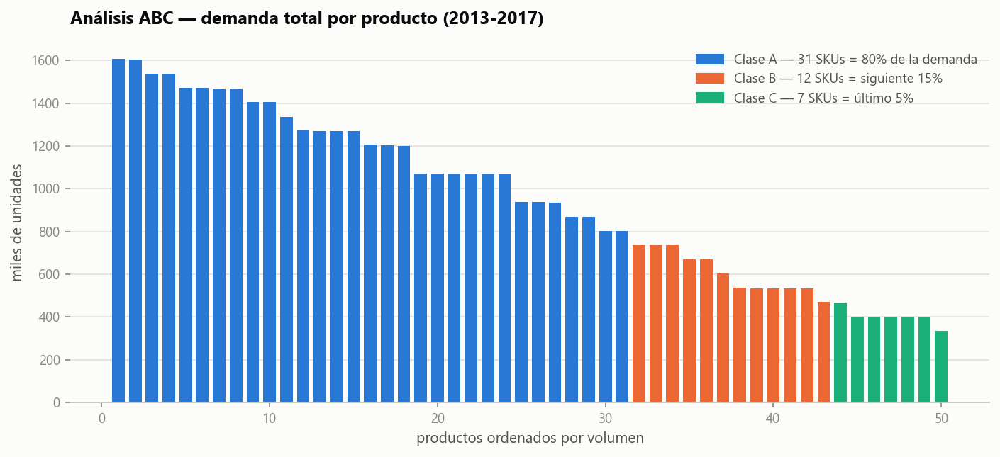
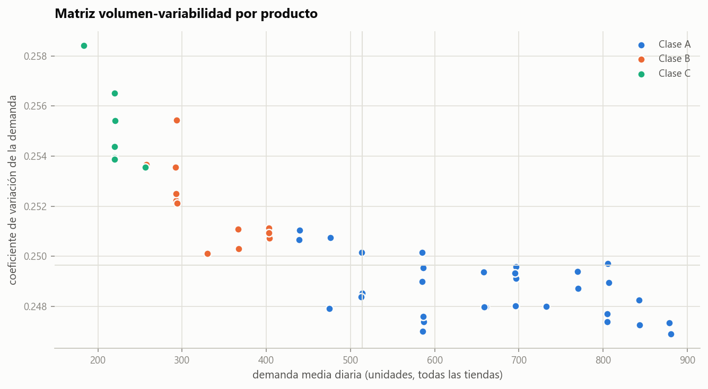
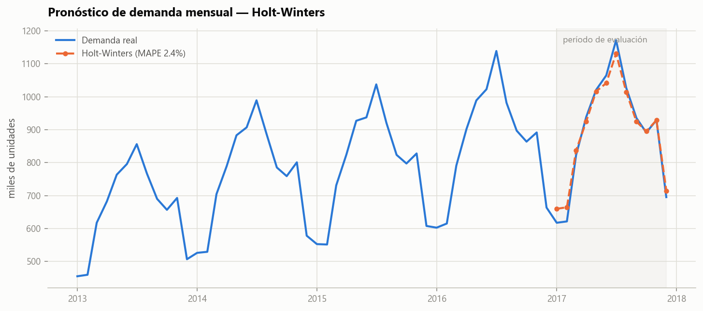
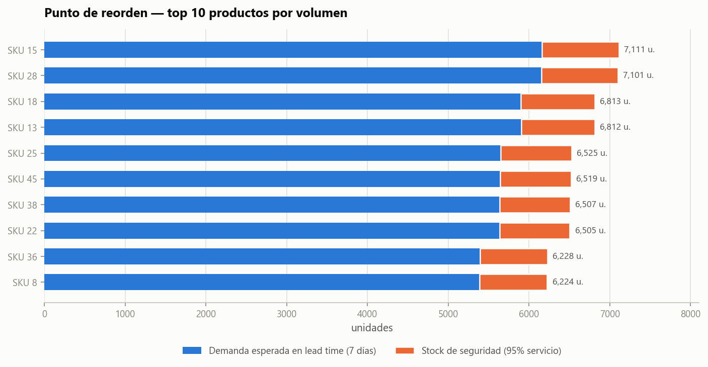

# Inventario y predicción de demanda 📦

Gestión de inventario basada en datos sobre **913.000 registros de ventas diarias**
(50 productos × 10 tiendas, 2013-2017): análisis ABC, matriz volumen-variabilidad,
pronóstico de demanda con Holt-Winters y política de reposición con punto de
reorden y stock de seguridad.

**Stack:** Python · Pandas · NumPy · statsmodels · Matplotlib

---

## Antes de las conclusiones: este dataset es sintético

Perfilando los datos encontré dos señales que muestran que fueron generados
artificialmente, no medidos:

- El **coeficiente de variación de los 50 productos va de 0,2469 a 0,2584**. Un
  rango de un punto porcentual entre 50 productos distintos no existe en una
  operación real, donde conviven productos estables con otros erráticos.
- **Cada tienda representa la misma proporción de ventas en todos los productos**
  (el desvío de esa proporción entre productos es 0,0003). La tienda 3 vende el
  11,4% del producto 1, del producto 2 y del producto 47. Eso solo pasa si la
  serie se generó como `factor_tienda × factor_producto × estacionalidad + ruido`.

Los chequeos están en [`src/profile_data.py`](src/profile_data.py), que
además valida nulos, duplicados y cobertura del calendario. Corrélo y vas a ver
los mismos números.

Lo dejo escrito porque cambia cómo hay que leer el resto: **las conclusiones de
negocio no son extrapolables a una operación real, la metodología sí.** El corte
ABC de acá, por ejemplo, no se parece al 20/80 que suele aparecer en inventarios
reales.

## Conclusiones

- 31 de 50 SKUs explican el 80% del volumen. En un inventario real esperaría algo
  más cercano a 20/80; acá el reparto es más plano porque la demanda se generó
  pareja entre productos (ver arriba).
- La variabilidad relativa es prácticamente idéntica entre productos, así que la
  matriz volumen-variabilidad no separa grupos como lo haría con datos reales.
  Con dispersión genuina, este gráfico es la base para combinar ABC con XYZ y
  definir políticas distintas por grupo.
- El pronóstico mensual con Holt-Winters da 2,4% de MAPE sobre 2017 (validación
  fuera de muestra), mejor que el baseline naive estacional (3,4%). Probé las
  variantes aditiva y multiplicativa y me quedé con la aditiva, que validó mejor
  (la multiplicativa daba 4,4%). Esta parte sí es metodológicamente sólida: la
  estacionalidad del dataset es regular y el modelo la captura bien.
- Con lead time de 7 días y 95% de nivel de servicio, los puntos de reorden de
  los SKUs líderes quedan entre 6.200 y 7.100 unidades, con el stock de
  seguridad pesando ~13% del total.

## Visualizaciones

### Clasificación ABC


### Perfil de demanda por producto


### Pronóstico de demanda


### Política de reposición


## Fuente de datos

[Store Item Demand Forecasting Challenge](https://www.kaggle.com/c/demand-forecasting-kernels-only)
(Kaggle) — ventas diarias de 50 productos en 10 tiendas durante 5 años.
Se descarga desde un espejo público para que el pipeline sea reproducible
sin credenciales.

## Reproducir el análisis

```bash
pip install -r requirements.txt

# 1. Descargar los datos (~17 MB)
python src/download_data.py

# 2. Perfilar los datos (integridad y pruebas de plausibilidad)
python src/profile_data.py

# 3. Generar las figuras
python src/analysis.py
```

## Estructura

```
├── src/
│   ├── download_data.py     # descarga del dataset
│   ├── profile_data.py      # integridad + detección de datos sintéticos
│   └── analysis.py          # ABC, forecast y política de inventario
├── figures/                 # gráficos generados (PNG)
├── data/                    # datos crudos (no versionados)
└── requirements.txt
```

## Notas metodológicas

- **ABC**: clase A hasta el 80% del volumen acumulado, B hasta el 95%, C el resto.
  Clasificado por unidades porque el dataset no trae precios; en una operación
  real conviene hacerlo por facturación o margen.
- **Pronóstico**: entrenamiento 2013-2016, evaluación sobre 2017 completo.
  Modelo `ExponentialSmoothing(trend="add", seasonal="add", seasonal_periods=12)`.
- **Punto de reorden** = demanda media diaria × lead time + stock de seguridad,
  con SS = z·σ·√LT (z = 1,65 para 95% de nivel de servicio, LT = 7 días).
- Los parámetros de lead time y nivel de servicio son supuestos configurables
  en `src/analysis.py`.

---

**Clemente Cifuentes** — Data Analyst ·
[LinkedIn](https://linkedin.com/in/clementecifuentes) ·
[Portafolio](https://github.com/clementecifuentes)
